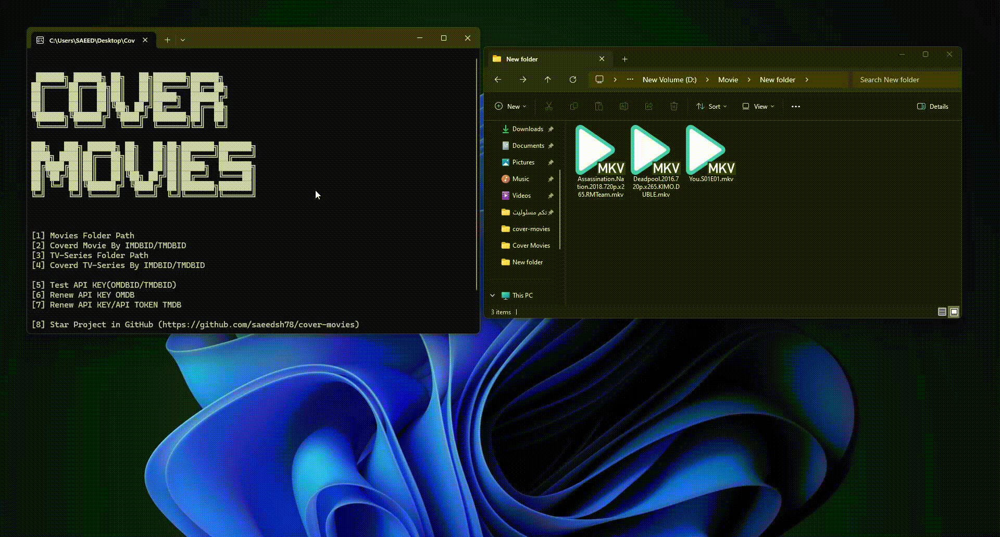

[](https://choosealicense.com/licenses/mit/)


# Cover Movies

This Python project is designed to manage and display movies and TV series. The program creates folders for each movie and series, places relevant icons in the folders, and saves movie details in a text file. It also downloads and stores images of actors, directors, and writers in the respective folders.
## Features

- Search and manage movies and TV series
- Create dedicated folders for each movie and series
- Download and place icons and movie details in the folders
- Save images of actors, directors, and writers


## Demo




## Installation

1. Clone the repository:
   ```bash
   git clone https://github.com/saeedsh78/cover-movies.git
   cd cover-movies
   ```
2. Install the dependencies:
    ```bash
    pip install -r requirements.txt
    ```

## Usage
- To use this code, you must first get the **api key** from [omdbapi.com](https://www.omdbapi.com/) and [themoviedb.org](https://www.themoviedb.org/) and put it in the `.env` file.
```env
OMDB_API_KEY=
THEMOVIEDB_API_KEY=
THEMOVIEDB_API_TOKEN=
```
- And run `main.py` file.
```python
python main.py
```

