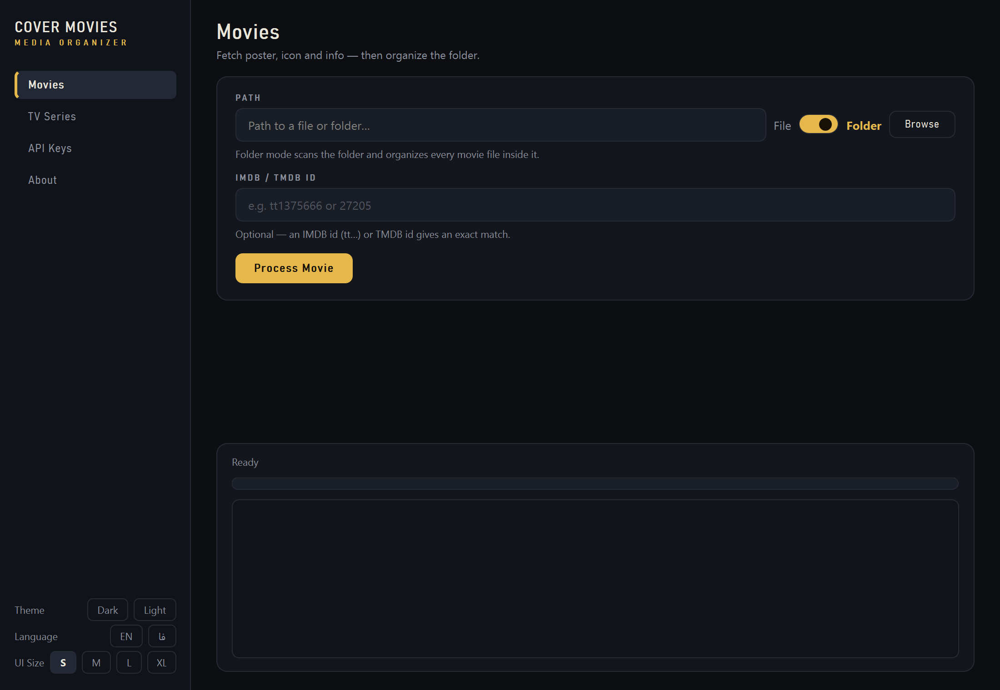
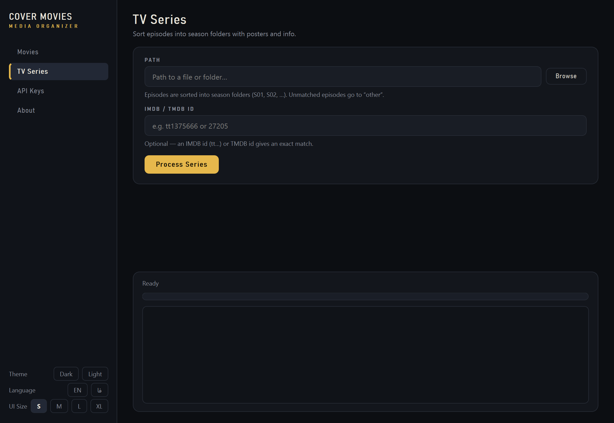
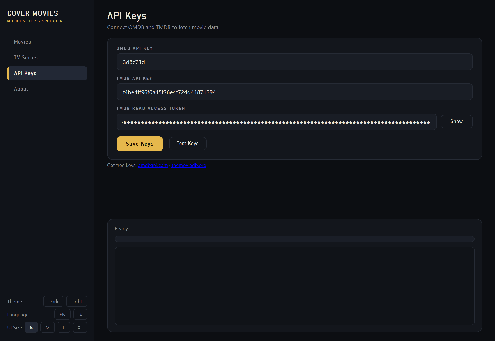
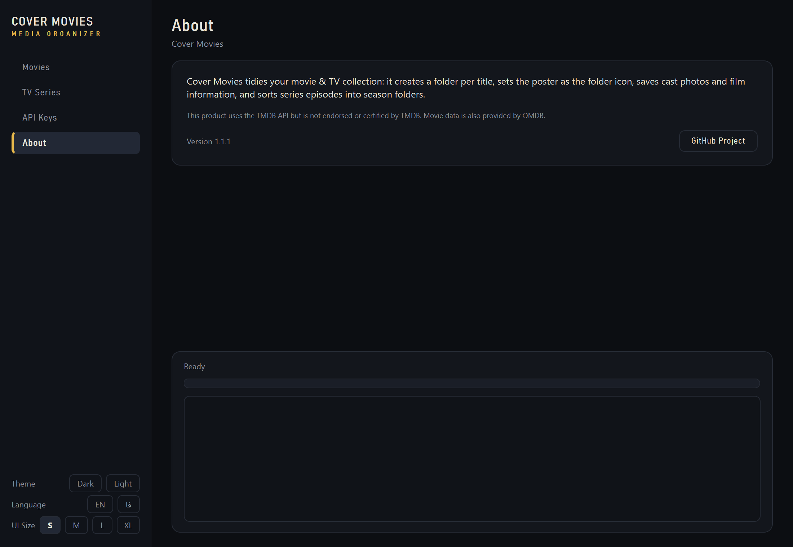

<p align="center">

   

</p>

<p align="center">

   <a href=""></a>

   <a href="https://choosealicense.com/licenses/mit"></a>

   <a href=""></a>

</p>

# Cover Movies

A desktop app (PyQt5) that tidies your movie & TV collection on Windows. Give it a movie file/folder or a series folder, and it will:

- Match each title against **TMDB / OMDB** by name or by an exact IMDB/TMDB ID
- Create a dedicated folder per title and set the poster as the **folder icon** (a standard 256px `poster.ico` + hidden `desktop.ini`, refreshed live even while Explorer windows are open)
- Save film information to `information.txt` and **cast photos** (actors, director, writers) into the folder
- Sort series episodes into **season folders** (`S01`, `S02`, …) with season posters; unmatched files go to `other`

Everything runs in a background thread with a live log, so the UI never freezes — and you can cancel mid-run.

## Screenshots

| Movies | TV Series |
|---|---|
|  |  |

| API Keys | About |
|---|---|
|  |  |

## Features

- **GUI** — dark & light "Cinema Marquee" themes, English/فارسی (full RTL), and S / M / L / XL UI scaling
- **Movies** — File mode (single movie) or Folder mode (batch-process every video in a folder)
- **TV Series** — episode sorting into season folders, season posters, and IMDB ID lookup
- **API Keys page** — keys are saved to `config.json` and can be verified in-app with **Test Keys**, which reports each service's connection status in the log
- **Network friendly** — detects the Windows system proxy automatically (VPN/proxy aware) and falls back to a direct connection if the proxy fails
- **Standalone EXE** — build a single-file Windows executable, no Python required (see below)

## Installation

1. Clone the repository:

   ```bash
   git clone https://github.com/saeedsh78/cover-movies.git
   cd cover-movies
   ```

2. Install the dependencies:

   ```bash
   pip install -r requirements.txt
   ```

## Usage

1. Run the app:

   ```bash
   python gui.py
   ```

2. Open the **API Keys** page and enter your keys:

   - **OMDB API Key** — free key from [omdbapi.com](https://www.omdbapi.com/apikey.aspx)
   - **TMDB API Key** — from [themoviedb.org](https://www.themoviedb.org/settings/api) (API Key v3)
   - **TMDB Read Access Token** — optional (API Read Access Token v4)

   Click **Save Keys** (stored in `config.json` next to the app) and **Test Keys** to verify — the log shows each service's result, e.g. `OMDB API: Connected successfully ('The Shawshank Redemption')`.

   Alternatively, edit `config.json` directly:

   ```json
   {
     "OMDB_API_KEY": "your_key",
     "THEMOVIEDB_API_KEY": "your_key",
     "THEMOVIEDB_API_TOKEN": "your_token"
   }
   ```

3. Go to the **Movies** or **TV Series** page:

   - **Movies** — pick *File* mode for a single video, or *Folder* mode to process every movie inside a folder. The ID field (`tt1375666` or `27205`) is optional but gives an exact match.
   - **TV Series** — pick the folder that contains the episodes; they are sorted into season folders automatically.

4. Click **Process** and watch the log. When finished, each title folder contains:

   ```
   Movie Title/
   ├── poster.ico        (folder icon — shown automatically)
   ├── desktop.ini       (hidden)
   ├── information.txt
   ├── Movie Name - Actor.jpg / - Director.jpg / - Writer.jpg
   └── Movie Name.jpg    (poster)
   ```

### Build a standalone EXE

Requires Python + the dependencies above, then:

```bash
python -m PyInstaller --noconfirm --onefile --windowed --icon="CoverMovies.ico" --add-data "CoverMovies.ico;." --name "CoverMovies" gui.py
```

The executable is written to `dist/CoverMovies.exe`.

### Note

The app sets folder icons the standard Windows way and refreshes open Explorer windows automatically. If a cover ever fails to appear, right-click the folder and go to **Properties → Customize → OK** to force a refresh.

This product uses the TMDB API but is not endorsed or certified by TMDB. Movie data is also provided by OMDB.

## License

[MIT](https://choosealicense.com/licenses/mit)
